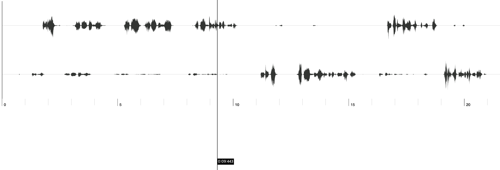

# Draw HLS Waveform

This example uses
[wavesurfer.js](https://github.com/katspaugh/wavesurfer.js) and [hls.js](https://github.com/video-dev/hls.js).



## 테스트

3시간 짜리 음성 녹음 파일 테스트

- Chrome, Safari
- 로컬에서 파일 다운로드 (.m3u8, .ts)
- 소요시간: 90~100초
- Safari에서는 메모리 부족으로 페이지 re-load 발생.

## 결론

wavesurfer.js가 음성 데이터를 한꺼번에 넣어야 하는 구조여서 매우 큰 audio buffer를 만들어야 한다.
ts 단위로 decoding된 데이터를 넣어주어서 waveform을 그려주는 library가 있다면 가능하겠지만, 현재로써는 대용량 음성인 경우 클라이언트에서는 쓸 수 없다고 보는게 맞음. 직접 canvas 그리는 방법도 있겠지만 그건 내 능력 밖이라서 패스.
막상 만들기는 했는데 서버 사이드에서 하는게 좋다고 생각함.

## wavesurfer.js 외의 다른 Waveform library

- waveform-data.js
- peaks.js

## ETC

### Convert mp4 to m3u8

```
ffmpeg -i test.m4a -profile:v baseline -strict -2 -level 3.0 -start_number 0 -hls_time 4 -hls_list_size 0 -f hls test.m3u8
```
